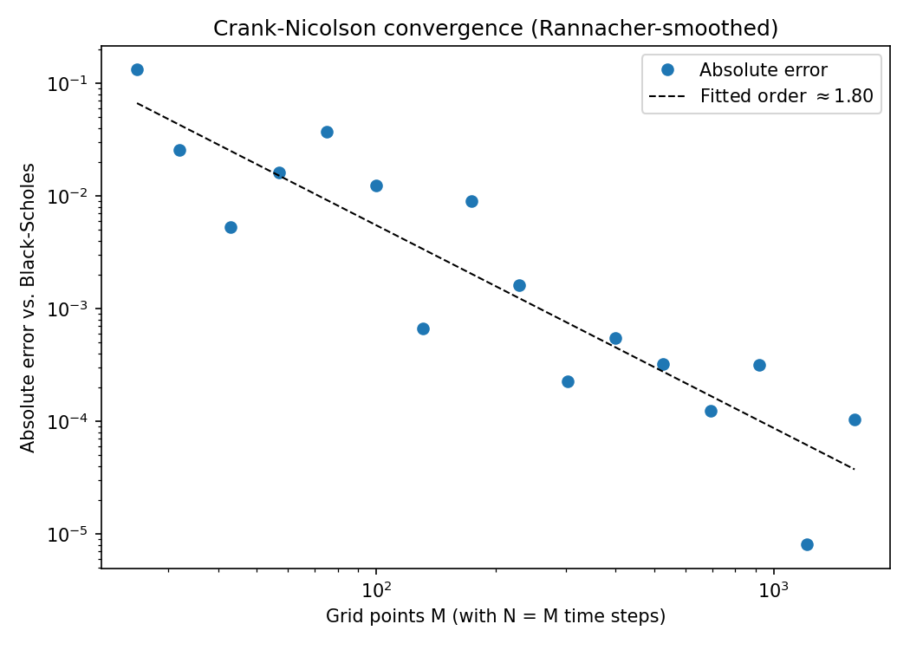
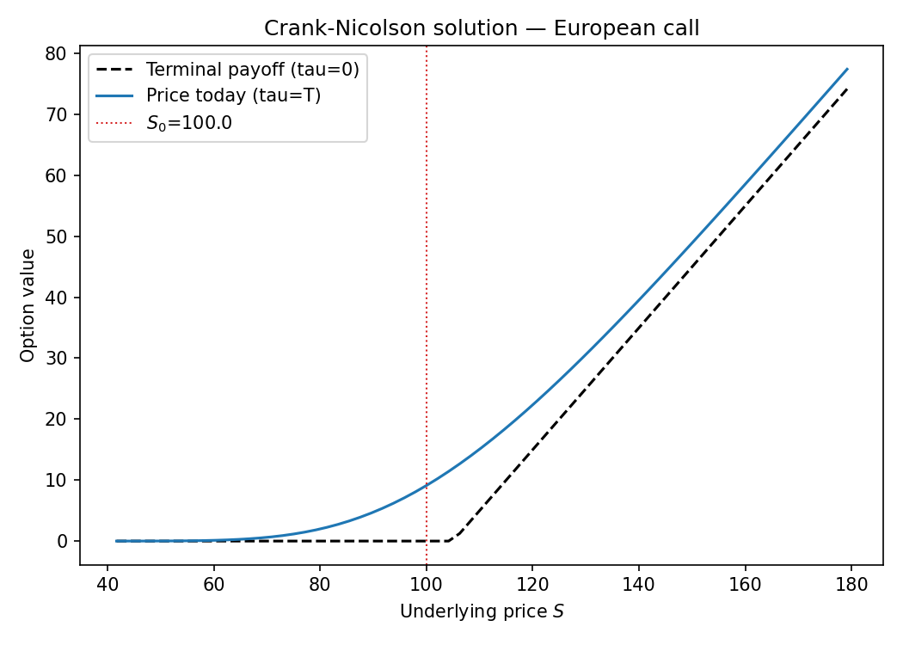

# Finite-Difference Option Pricing

Pricing European options by solving the Black-Scholes PDE with a
Crank-Nicolson finite-difference scheme, benchmarked against the closed-form
solution.



## Method

The no-arbitrage price V(S, t) of a European option satisfies the
Black-Scholes PDE:

```
dV/dt + 0.5 sigma^2 S^2 d2V/dS2 + r S dV/dS - r V = 0,   V(S, T) = payoff(S)
```

Substituting the backward time variable `tau = T - t` turns this into an
initial value problem: start from the known terminal payoff at `tau=0` and
march forward to `tau=T` (today's price), instead of needing a terminal
condition at an unknown future price.

Each step discretizes the PDE on a uniform grid in `S` with a **theta-scheme**:

```
V_i^{n+1} - V_i^n = theta * dtau * f(V^{n+1}) + (1-theta) * dtau * f(V^n)
```

- `theta = 0.5` is **Crank-Nicolson**: unconditionally stable and second-order
  accurate in both `S` and `tau`, so the grid can be refined without a
  stability constraint on the time step (unlike an explicit scheme).
- `theta = 1` is **fully implicit**: only first-order accurate, but damps
  high-frequency error more aggressively.

The payoff has a kink at the strike (a discontinuous first derivative), which
pollutes Crank-Nicolson's clean second-order convergence with spurious
oscillations for the first few steps. The standard fix — **Rannacher
smoothing** — starts the march with a couple of fully implicit steps before
switching to Crank-Nicolson, damping that high-frequency error while keeping
second-order convergence overall (fitted order ≈ 1.8–2.0 empirically; see the
convergence plot above, and note individual grid sizes still show some noise
from the kink, which is why the order is estimated by a log-log fit across
many grid sizes rather than read off two points).

The grid spacing is chosen so that `S0` falls exactly on a node — the price
then needs no interpolation, and delta/gamma are read directly off the grid
via central differences on the neighboring nodes:



Vega and rho are obtained by bumping `sigma`/`r` and re-solving (two extra
PDE solves each). Unlike Monte Carlo, this is exact up to discretization
error — the solver is fully deterministic, so there's no simulation noise to
average out.

## Project layout

```
src/fd_option_pricing/
    black_scholes.py       closed-form price and Greeks (benchmark)
    finite_difference.py    Crank-Nicolson PDE solver, crank_nicolson_price, fd_greeks
tests/test_pricer.py        convergence order, parity, and Greeks checks
examples/run_example.py     prints a price/Greeks table and saves convergence + price-curve plots
```

## Usage

```bash
pip install -r requirements.txt
python examples/run_example.py   # or: pip install -e .[dev]
pytest
```

```python
from fd_option_pricing import crank_nicolson_price, fd_greeks

result = crank_nicolson_price(S0=100, K=105, r=0.03, sigma=0.25, T=1.0, option_type="call")
print(result.price, result.delta, result.gamma, result.theta)

greeks = fd_greeks(S0=100, K=105, r=0.03, sigma=0.25, T=1.0, option_type="call")
```

## Sample results

`S0=100, K=105, r=3%, sigma=25%, T=1y`, 200x200 grid:

| | Black-Scholes | Crank-Nicolson |
|---|---|---|
| Price | 9.1218 | 9.1213 |
| Delta | 0.5199 | 0.5197 |
| Gamma | 0.0159 | 0.0159 |
| Vega | 39.8447 | 39.8466 |
| Theta | -6.2666 | -6.2730 |
| Rho | 42.8657 | 42.8621 |

## Monte Carlo vs. finite differences

See [../monte-carlo-option-pricing](../monte-carlo-option-pricing) for the
same pricing problem solved by simulation. The two make a natural pair:
finite differences are fast and get Greeks essentially for free from the
grid, but the grid's cost grows quickly with dimension; Monte Carlo scales to
high-dimensional and path-dependent payoffs that a grid can't reach, at the
cost of statistical noise instead of discretization error.

## Possible extensions

- American-style early exercise via a projected/PSOR solve at each time step.
- Path- or barrier-dependent payoffs by modifying the boundary conditions.
- Non-uniform grids (finer spacing near the strike) for better resolution at
  the payoff kink without increasing `M` everywhere.
