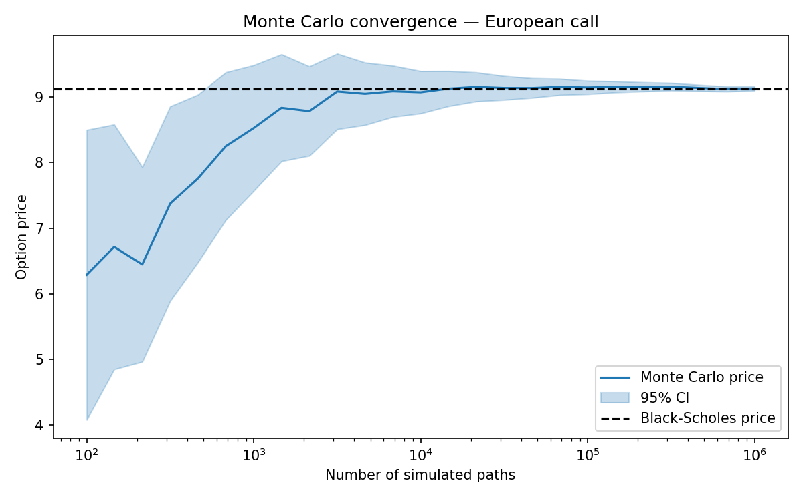

# Monte Carlo Option Pricing

Pricing European options by Monte Carlo simulation under the Black-Scholes-Merton
model, benchmarked against the closed-form solution.



## Method

Under the risk-neutral measure, the underlying follows geometric Brownian motion:

```
dS_t = r S_t dt + sigma S_t dW_t
```

which has an exact solution at maturity `T`, so a European payoff can be priced
by drawing `S_T` directly instead of stepping through a full path:

```
S_T = S0 * exp((r - sigma^2 / 2) * T + sigma * sqrt(T) * Z),   Z ~ N(0, 1)
```

The option price is the discounted expected payoff, estimated by the sample
mean over `n` simulated draws of `S_T`:

```
price ≈ exp(-r T) * mean(payoff(S_T))
```

Two techniques used to make the estimate more efficient:

- **Antithetic variates** — each draw `Z` is paired with `-Z`, which cancels
  first-order simulation noise and roughly halves the variance for a given
  path count.
- **Common random numbers for Greeks** — `mc_greeks` estimates sensitivities
  by central finite differences (bump-and-reprice). Each bumped scenario
  reuses the same random seed as the base case, so the *difference* between
  runs is driven by the bump itself rather than by fresh Monte Carlo noise.

Every estimate is reported with its standard error and a 95% confidence
interval — a Monte Carlo price without an error bar isn't a finished result.

## Project layout

```
src/mc_option_pricing/
    black_scholes.py   closed-form price and Greeks (benchmark)
    monte_carlo.py      GBM simulation, mc_price, mc_greeks
tests/test_pricer.py    convergence, parity, and variance-reduction checks
examples/run_example.py prints a price/Greeks table and saves a convergence plot
```

## Usage

```bash
pip install -r requirements.txt
python examples/run_example.py   # or: pip install -e .[dev]
pytest
```

```python
from mc_option_pricing import mc_price, mc_greeks

result = mc_price(S0=100, K=105, r=0.03, sigma=0.25, T=1.0, option_type="call")
print(result.price, result.std_error, result.ci_95)

greeks = mc_greeks(S0=100, K=105, r=0.03, sigma=0.25, T=1.0, option_type="call")
```

## Sample results

`S0=100, K=105, r=3%, sigma=25%, T=1y`, 500,000 paths with antithetic variates:

| | Black-Scholes | Monte Carlo |
|---|---|---|
| Price | 9.1218 | 9.1294 ± 0.0232 |
| Delta | 0.5199 | 0.5199 |
| Gamma | 0.0159 | 0.0160 |
| Vega | 39.8447 | 39.9009 |
| Theta | -6.2666 | -6.2734 |
| Rho | 42.8657 | 42.8584 |

## Possible extensions

- Path-dependent payoffs (Asian, barrier, lookback) — these need the full
  simulated path, not just `S_T`, so `simulate_terminal_prices` would grow
  into a full path simulator.
- Stochastic volatility (Heston) or jump-diffusion (Merton) dynamics.
- Quasi-Monte Carlo (Sobol sequences) for faster convergence.
